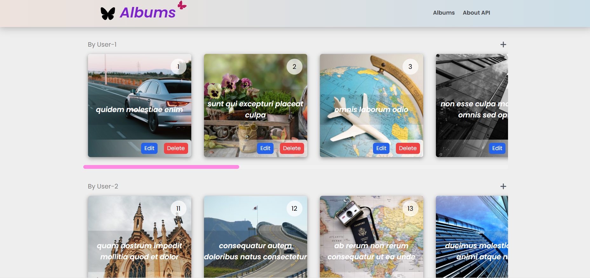
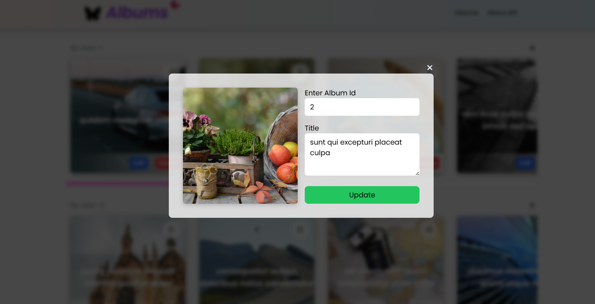
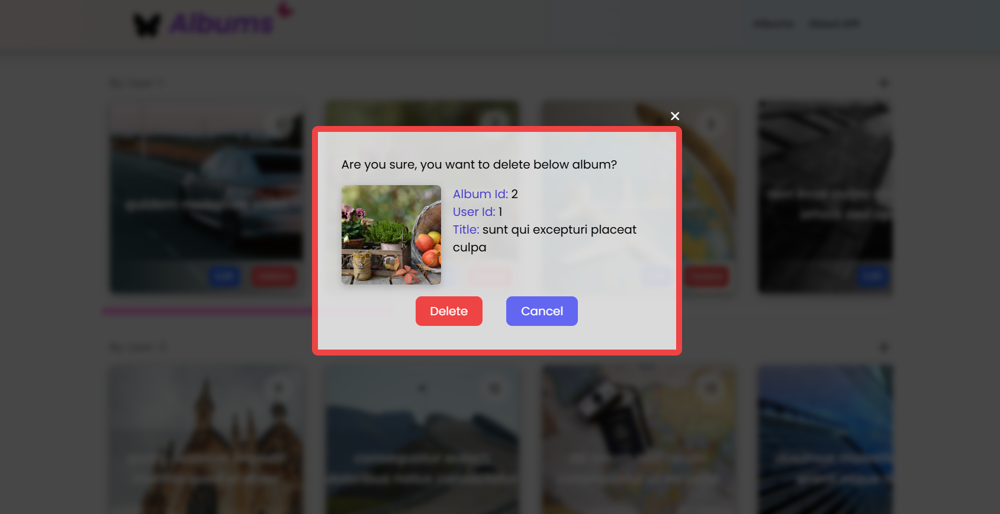
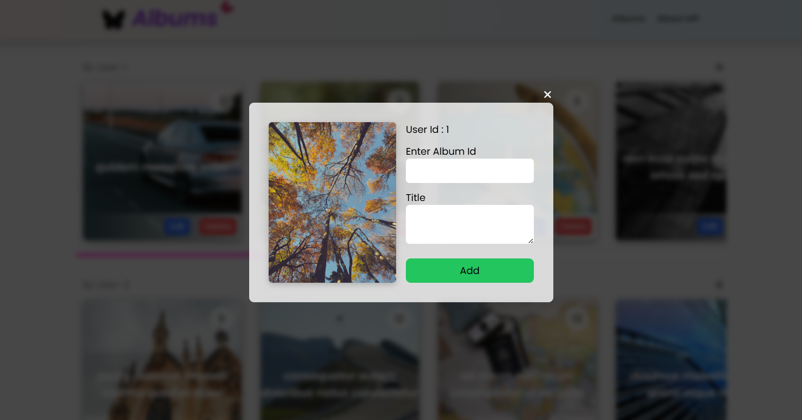

# Album API fetch demo project with React

This project is an example to demonstrate the album API fetch from JSON Placeholder website. API need no authorization, and has no limit on number of requests made.


## Technology used

React, TailwindCSS

## Features

- attracive UI with colorful random images assigned for individual album
- Modal for edit, delete, and adding new album
- API https request for all the operations as:
    Loading data -> GET
    Adding new album -> POST 
    Updating an album -> PUT
    Deleting an album -> DELETE
- data validation before submitting the data
- responsive design to work with various screen sizes
- Success and failure message/notification using react-hot-toast
- Loader to show if data is still loading


## Installation

Install the project with npm
- open project folder with integrated terminal of VS Code
- run below command to install all the dependencies

```bash
  npm install
```
    
## Running Tests

To run tests in development mode, run the following command

```bash
  npm run dev
```


## Screenshots

Home Screen


Edit Modal/Screen


Delete Modal/Screen


Add new Album modal/screen



## Deployment

To deploy this project run below command to create the bundled 'dist' folder with all required files from the build graph

```bash
  npm run build
```
The example webpage is hosted here at netlify. Click below link to see the website

https://avinashalbumapi.netlify.app

## Support

For support, email avinashkgupta91@gmail.com


## 🔗 Links
[](https://codesimplified.in)

[](https://www.linkedin.com/in/avinash-kumar-gupta-b4a265285/)


